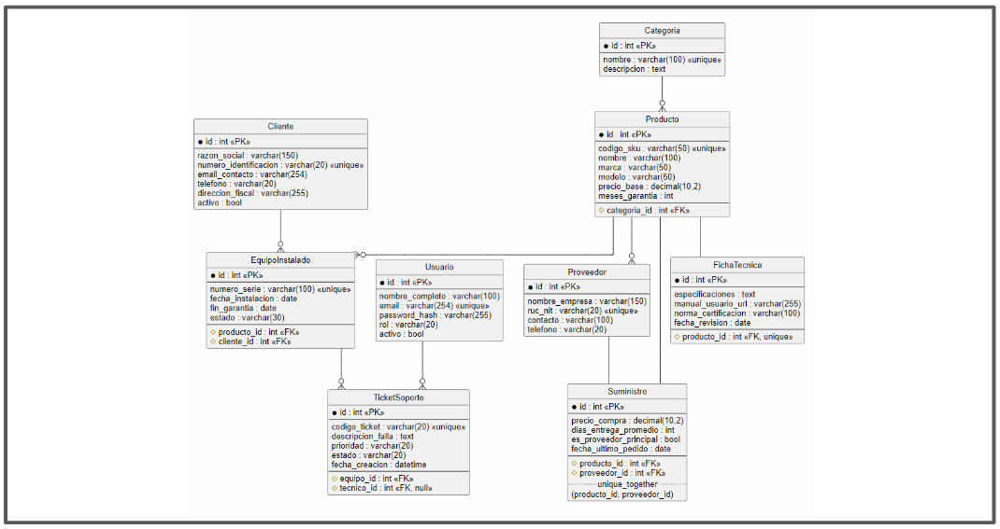

## Gestión de Equipos Médicos — Sistema Web (Django)
Sistema web para gestionar la cadena de suministro y el soporte postventa de una empresa distribuidora de equipos médicos: catálogo de productos, clientes, equipos instalados, tickets de soporte y proveedores.

### Problemática
Sistema web para gestionar la cadena de suministro y el soporte postventa de una empresa distribuidora de equipos médicos: catálogo de productos, clientes, equipos instalados, tickets de soporte y proveedores.

### Stack Tecnico
<a href="https://developer.mozilla.org/en-US/docs/Web/HTML" target="_blank"></a>
<a href="https://www.sqlite.org/" target="_blank"></a>

- **Backend:** ```Django 6.1 (Python 3.13)```
- **Base de datos:** ```SQLite (desarrollo)```
- **Frontend:** ```Django Templates (HTML)``` 

---

### Instalación y ejecución
##### 1. Clonar Repositorio
```
git clone https://github.com/D2GGutierrez/Gestion_de_Equipos_Medicos-Sistema_Web.git
```
```
cd Gestion_de_Equipos_Medicos-Sistema_Web
```
##### 2. Crear y activar entorno virtual
```
python -m venv .venv  ||  py -m venv .venv
```
```
.venv\Scripts\activate  (PowerShell)
```
```
source .venv/Scripts/activate  (Bash)
```
##### 3. Crear y activar entorno virtual
```
pip install -r requirements.txt
```
##### 4. Aplicar Migraciones
```
py manage.py migrate
```
##### 5. (Opcional) Crear superusuario para el panel de administración
```
py manage.py createsuperuser
```
##### 6. Levantar el servidor de desarrollo
```
py manage.py runserver
```
---
### Usuarios del sistema

| Rol | Responsabilidad |
|---|---|
| Administrador | Gestiona permisos, roles y configuraciones |
| Jefe de Inventario y Logística | Registra lotes, controla existencias y despachos |
| Asesor Comercial | Genera cotizaciones, registra clientes y órdenes de venta |
| Técnico de Soporte | Registra mantenimientos, diagnósticos y repuestos |
| Cliente | Solicita soporte y consulta el estado de sus equipos |

### Módulos y rutas (CRUD)

Todas las rutas viven bajo el prefijo `/inventario/` (definidas en `gestion/inventario/urls.py`):

| Módulo | Listar | Crear | Editar | Eliminar |
|---|---|---|---|---|
| Productos | `productos/` | `productos/crear/` | `productos/<pk>/editar/` | `productos/<pk>/eliminar/` |
| Clientes | `clientes/` | — | `clientes/<pk>/editar/` | `clientes/<pk>/eliminar/` |
| Usuarios | `usuarios/` | — | `usuarios/<pk>/editar/` | `usuarios/<pk>/eliminar/` |
| Equipos instalados | `equipos/` | — | `equipos/<pk>/editar/` | `equipos/<pk>/eliminar/` |
| Tickets de soporte | `tickets/` | — | `tickets/<pk>/editar/` | `tickets/<pk>/eliminar/` |
| Suministros (Producto↔Proveedor) | `productos/proveedores/` | `suministros/crear/<producto_pk>/` | `suministros/<pk>/editar/` | `suministros/<pk>/eliminar/` |
| Categorías | `categorias/<pk>/` (detalle) | — | — | — |

---
### Modelo de datos

| Entidad | Rol |
|---|---|
| `Cliente` | Clínica/hospital que compra equipos y reporta soporte |
| `Producto` | Equipo médico del catálogo |
| `Usuario` | Personal interno (admin, ventas, logística, técnico) |
| `EquipoInstalado` | Instancia física de un `Producto` en un `Cliente` |
| `TicketSoporte` | Incidencia técnica sobre un `EquipoInstalado` |
| `Categoria` | Clasificación de `Producto` |
| `FichaTecnica` | Detalle técnico exclusivo de un `Producto` |
| `Proveedor` | Empresa externa que abastece productos |
| `Suministro` | Modelo intermedio Producto↔Proveedor (precio de compra, días de entrega, proveedor principal) |



**Relaciones:**

| Relación | Tipo |
|---|---|
| Categoria → Producto | 1:N (`PROTECT`) |
| Producto → FichaTecnica | 1:1 |
| Producto ↔ Proveedor | N:M vía `Suministro` (con `unique_together`) |
| Producto → EquipoInstalado | 1:N (`CASCADE`) |
| Cliente → EquipoInstalado | 1:N (`CASCADE`) |
| EquipoInstalado → TicketSoporte | 1:N (`CASCADE`) |
| Usuario → TicketSoporte | 1:N (`SET_NULL`) |

### Requisitos funcionales

| Código | CRUD | Descripción |
|---|---|---|
| RF-01 | Crear | Registrar producto en catálogo (SKU, nombre, marca, modelo, costo base) |
| RF-02 | Crear | Registrar cliente (RUC/NIT, razón social, dirección, contacto) |
| RF-03 | Crear | Abrir ticket de soporte vinculado a un equipo |
| RF-04 | Leer | Listar equipos instalados con filtros (cliente, garantía, fecha) |
| RF-05 | Leer | Consultar panel de tickets filtrado por prioridad/estado |
| RF-06 | Actualizar | Editar datos de contacto/ubicación de un cliente |
| RF-07 | Actualizar | Actualizar estado de ticket, diagnóstico y repuestos |
| RF-08 | Eliminar | Baja lógica de usuarios/clientes inactivos |
